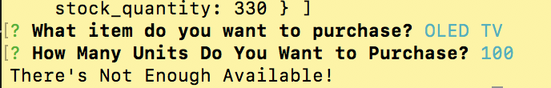

# bamazon-app

## Thank you for using the bamazon app. 

### Purpose: To familiarize myself with using **mysql**, and to *help* potential shoppers and business control inventory. 

### How does it work? 
##### Follow the steps to get shopping!: 

1. **npm install** in terminal or bash to pull in the required node packages 
2. Navigate into the **correct directory**, where bamazonCustomer.js is located. 
3. In the command line, type *node bamazonCustomer.js*. This will start the application. 

4. From here, view the items in inventory, and decide which one you would like to purchase by **typing it into** the command line. 

5. Choose how many units of that item you want to purchase by typing a **whole number** into the command line. 

* The app will let you know if the quantity you want is not possible.

* If it is, however, it will update the database in **mysql** and give you the total amount of your purchase

## I look forward to learning more and updating this app and other in the future! 
